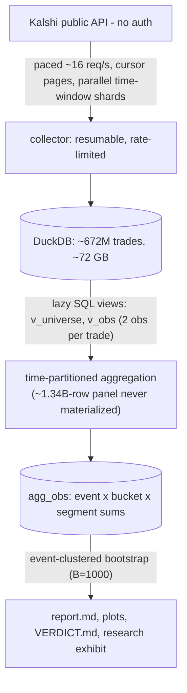

# Almost Certain

*A prediction-market experiment in 672 million trades.*

When a market is almost certain, how often is it right? This project follows that
question from public API collection through memory-bounded analysis to an
interactive field notebook. The package is still named `kalshi-flb`.

[Published page](https://dlustig.github.io/kalshi-flb/) ·
[Build and publish the exhibit](docs/publishing.md) ·
[Research methodology](DESIGN.md) ·
[Original report](analysis/out/report.md)

The exhibit presents a **frozen July 2026 snapshot**, not live market data. Its
three explorations compare calibration before/after publication, observed maker
and taker returns, and category-level estimates with uncertainty. The original
research artifacts remain available alongside the presentation.

## Run the exhibit locally

Python 3.12 builds the portable site from saved results without opening DuckDB:

```bash
python scripts/build_exhibit.py --out dist/site
python -m http.server --bind 127.0.0.1 8000 --directory dist/site
```

Open `http://localhost:8000`. The same folder supports Bitbucket static hosting,
including a project subdirectory. See [publishing](docs/publishing.md) for source
ownership, snapshot provenance, verification, and deployment.

## TL;DR

On a prediction market like [Kalshi](https://kalshi.com), a contract pays **$1
if some event happens** and **$0 if it doesn't**. The price is the crowd's odds:
a contract at **92¢** means "the market thinks this is 92% likely."

The experiment tests whether heavy favorites (80¢ up to, but excluding, 97¢) win more often than their
prices imply, after accounting for modeled fees. For example, a hypothetical
92¢ contract gains 8¢ if it pays $1 and loses 92¢ if it pays nothing, before fees.
Whether that produces a positive average depends on the outcome rate and costs.
The calculations use observed trade quantities, not independent coin flips.

The catch: the academic study that documented this bias,
[*Makers and Takers: The Economics of the Kalshi Prediction Market*](https://doi.org/10.2139/ssrn.5502658)
by Bürgi, Deng & Whelan, was **posted to SSRN in September 2025**, and the authors warned that publicity might
erode it. **This repo compares the periods before and after publication** —
collecting **672M real Kalshi trades** into DuckDB and re-measuring the pattern
net of modeled fees, with a research pass/fail rule fixed before the analysis.

**The saved result: a smaller pooled maker estimate, with an interval that
includes zero, and clearer positive estimates in some categories.** These are
historical modeled returns on observed fills, not evidence of achievable
execution. The before/after comparison does not establish a causal effect of
publication. See the original research rule in [`VERDICT.md`](VERDICT.md).

> Scope: **read-only, no authentication, no order placement.** This measures the
> edge; it does not trade it.

---

## The original research decision: GO under the category-based rule

The pre-committed GO criterion is met. Here is the headline statistic — maker
net expected value in the [80¢, 97¢) favorite band, pre- vs. post-publication:

| Maker net EV, [80¢, 97¢) | point estimate | clustered 95% CI | n |
|---|---:|:---:|---|
| **Pre**-publication  | **+2.13¢** / contract | [+0.40, +3.59] | — |
| **Post**-publication | **+0.81¢** / contract | [−0.03, +1.60] | 15.3B contracts, 287,770 events |

The pooled post-publication interval includes zero — but the pre-committed GO
criterion (a CI-positive edge in ≥1 liquid category) is met in multiple
non-sports categories: **Politics +5.7¢, Economics +5.3¢, Crypto +1.3¢** (the
largest event sample among those three — 1.9B contracts across 130k events), and more. Three
findings from the segmentation:

- **Sports — the volume majority — has an interval crossing zero.** That does
  not prove a zero effect; its saved maker estimate is +0.424¢ per contract.
- **Maker and taker curves differ.** These compare observed roles under the fee
  model, with different samples; the difference cannot be attributed solely to
  fees or translated directly into an execution recommendation.
- The **>24h before close** group has an estimated +2.1¢ return with an interval
  above zero; the final-24h estimate is +0.6¢ with an interval crossing zero.

The ~62% reduction is between pooled point estimates. The original rule checks
for a qualifying category; it is not a pooled-significance test, and inspecting
multiple category intervals is not automatically multiplicity-adjusted.

→ One-page verdict: [`VERDICT.md`](VERDICT.md) · Full analysis (calibration
tables, net-return curves, segmentation, sensitivity, exclusions, caveats):
[`analysis/out/report.md`](analysis/out/report.md).

---

## Architecture



The panel expands each trade into a Yes-side and a No-side observation
(~1.34B rows); it is never materialized — aggregation runs in DuckDB in
time-partitioned passes into `agg_obs`, and every statistic reads that.

| Module | Responsibility |
|---|---|
| [`api.py`](src/kalshi_flb/api.py) | Thread-safe paced HTTP client; blind exponential backoff; cursor pagination that survives empty-page-with-cursor anomalies |
| [`db.py`](src/kalshi_flb/db.py) | Schema, dollar-string parsers, vectorized batch writes, per-stream cursor state, memory-capped connections |
| [`collector.py`](src/kalshi_flb/collector.py) | Resumable streams; ~50 disjoint time-window trade shards walked in parallel with failure isolation, retry rounds, and a disk guard |
| [`fees.py`](src/kalshi_flb/fees.py) | Fee engine (rounding eras, maker/taker) with a **SQL twin parity-tested** against the Python reference |
| [`panel.py`](src/kalshi_flb/panel.py) | Lazy observation-panel views + time-partitioned `agg_obs` materialization + exclusion accounting |
| [`calibration.py`](src/kalshi_flb/calibration.py) | Bucket stats + event-clustered percentile bootstrap; `headline()` = the deliverable statistic |
| [`report.py`](src/kalshi_flb/report.py) | `report.md` + plots + **mechanical** application of the go/no-go criteria → `VERDICT.md` |

### Engineering worth noting

- **Billion-row analysis on a memory-constrained box.** The expanded panel is
  ~1.34B rows; it is never materialized. Aggregation runs in DuckDB in
  time-partitioned passes (week-slices for 100M+ trade months) with a hard
  memory cap, a disk-spill directory, and a self-abort — after an early
  unbounded run froze the machine (see [`DESIGN.md`](DESIGN.md) §4).
- **The API's real bottleneck is per-cursor latency, not the rate limit.** A
  single cursor is sequential at ~1.4s/page, so the collector parallelizes
  *disjoint time-window shards* over one shared paced client, with each shard
  isolated, logged, and retried independently.
- **Statistically honest CIs.** Outcomes within an event are correlated (Yes/No
  symmetry, multi-strike events), so every interval is an event-clustered
  bootstrap — naive binomial CIs would overstate significance.
- **Pre-committed criteria, applied by code.** The go/no-go rule was fixed in
  the spec; `report.py` applies it mechanically — no post-hoc goalpost-moving.
- **Analytical tests:** known-answer statistics, synthetic calibration/bias-detection,
  SQL↔Python fee parity, and collector logic against recorded API fixtures.
- **Publication checks:** snapshot-to-page consistency, portable evidence bundles,
  missing-value preservation, and browser selection/URL behavior. Run Python tests
  with `uv run pytest` and browser model tests with
  `node --test tests/web/*.test.mjs` (Node 22).
- **Lightweight typechecking:** `uv run --frozen mypy` checks the Python package
  and exhibit builder in CI, including bodies of unannotated functions. This is
  gradual typing, not strict mode: pandas internals and the standalone data
  maintenance/export scripts are outside this initial coverage.

---

## Reproduce

```bash
uv sync
uv run --frozen mypy                   # Python typecheck (also runs in CI)
uv run pytest                          # analysis + publication tests

uv run kalshi-flb status               # DB + per-stream collection state
uv run kalshi-flb backfill --rps 16    # full collect from the public API (resumable; hours)
uv run python scripts/dq_check.py      # data-quality gate — run before trusting analysis
uv run kalshi-flb report               # rebuild agg_obs + report.md + VERDICT.md
```

The DuckDB file (≈72 GB) is gitignored. The committed
[`analysis/out/`](analysis/out/) bundle preserves the saved report, and
`web/data/stats.json` preserves its interactive export. Rebuilding the page
reproduces the display of those results; recomputing the statistics requires
the matching research inputs. A new public-API backfill may differ from the
historical snapshot.

> ⚠️ The heavy commands scan ~5×10⁸ rows. On a memory-constrained machine, run
> them under the cgroup cage described in [`AGENTS.md`](AGENTS.md) — an uncaged
> run has frozen this box before.

---

## Layout

```
kalshi-flb/
├── VERDICT.md              the one-page answer
├── DESIGN.md               methodology + the decision-log "WHYs" + provenance
├── AGENTS.md               operating commands + machine-safety protocol
├── analysis/out/           committed evidence: report.md, VERDICT.md, plots/
├── docs/                   design-spec.md, kalshi-api-notes.md, research-brief.md
├── src/kalshi_flb/         api · db · collector · fees · panel · calibration · report · cli
├── scripts/                collection checks, analytical export, exhibit builder
├── web/                    exhibit source, saved chart data, generated preview
└── tests/                  analytical, publication, and browser model tests
```

**Stack:** Python 3.12 (uv), DuckDB, httpx, numpy, pandas, matplotlib.

**Further reading:** [`DESIGN.md`](DESIGN.md) for the methodology and the
hard-won decisions · [`docs/design-spec.md`](docs/design-spec.md) for the spec
and verified API-drift addendum · [`docs/research-brief.md`](docs/research-brief.md)
for why Kalshi was the chosen edge.
