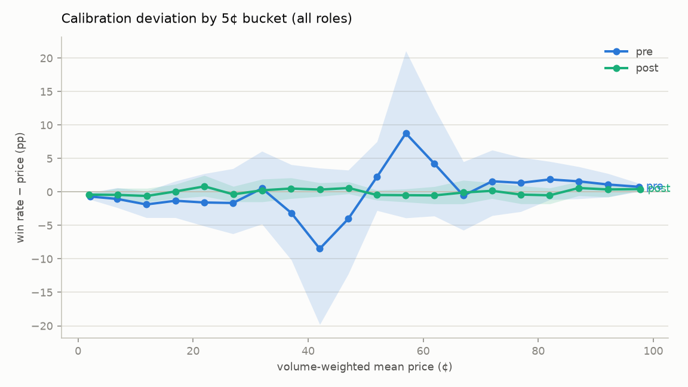
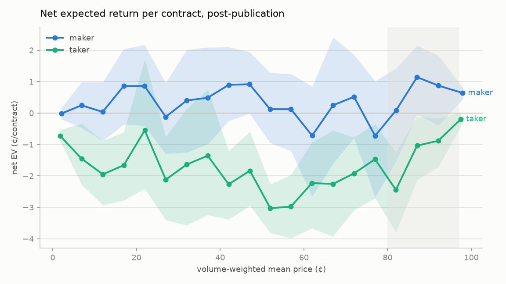

# Kalshi favorite–longshot bias — post-publication verification

Generated 2026-07-03 03:31Z. Window: trades ≥ 2024-01-01; decay split at 2025-09-18 (SSRN publication).

## Data summary

| table | rows |
|---|---|
| series | 11,141 |
| events | 435,396 |
| markets | 11,843,860 |
| trades | 671,921,586 |

Trade span: 2023-12-31 19:48:18.151070-05:00 → 2026-07-02 03:00:00.354546-04:00. Aggregated panel: 48,759,259 event×bucket×segment cells.

Monthly trade counts:

| m       |         c |
|:--------|----------:|
| 2023-12 |        72 |
| 2024-01 |    195777 |
| 2024-02 |    188595 |
| 2024-03 |    178368 |
| 2024-04 |    172903 |
| 2024-05 |    125189 |
| 2024-06 |    120556 |
| 2024-07 |    134280 |
| 2024-08 |    126535 |
| 2024-09 |    141564 |
| 2024-10 |    450388 |
| 2024-11 |   2702031 |
| 2024-12 |   1049415 |
| 2025-01 |   1345398 |
| 2025-02 |   1849868 |
| 2025-03 |   2923853 |
| 2025-04 |   2167025 |
| 2025-05 |   2667210 |
| 2025-06 |   3108304 |
| 2025-07 |   3389179 |
| 2025-08 |   4156584 |
| 2025-09 |   9760732 |
| 2025-10 |  16103026 |
| 2025-11 |  21460794 |
| 2025-12 |  28424152 |
| 2026-01 |  51267532 |
| 2026-02 |  67012572 |
| 2026-03 |  82334574 |
| 2026-04 |  87021624 |
| 2026-05 | 101501510 |
| 2026-06 | 171262221 |
| 2026-07 |   8579755 |

### Exclusions

| reason                           |               n |
|:---------------------------------|----------------:|
| markets_non_binary               |     0           |
| markets_mve                      |     1.17624e+06 |
| markets_result_void              |     0           |
| markets_result_empty             |     0           |
| markets_result_other             | 29225           |
| markets_pre_window               | 48892           |
| markets_no_series_metadata       |  7695           |
| markets_flat_fee                 |     0           |
| trades_mve_by_prefix             |     0           |
| trades_mve_dropped_at_collection |     5.82848e+07 |
| trades_orphaned                  |     9.57637e+06 |
| trades_on_excluded_markets       |     1.70329e+06 |
| trades_null_taker                |     0           |
| markets_null_volume              |     0           |
| trades_nonpositive_count         |     0           |
| trades_null_price                |     0           |

## Calibration (5¢ buckets, all roles)

### pre

| bucket | n | mean price | win rate | 95% CI |
|---|---|---|---|---|
| 0–4¢ | 1,640,198,116 | 2.14¢ | 1.45% | [0.99, 2.06] |
| 5–9¢ | 952,234,937 | 6.81¢ | 5.76% | [4.47, 7.43] |
| 10–14¢ | 700,163,248 | 11.88¢ | 10.01% | [8.04, 11.98] |
| 15–19¢ | 604,480,523 | 16.92¢ | 15.60% | [13.08, 18.54] |
| 20–24¢ | 573,695,884 | 21.95¢ | 20.37% | [16.85, 24.68] |
| 25–29¢ | 578,584,992 | 26.94¢ | 25.28% | [20.68, 30.42] |
| 30–34¢ | 577,189,576 | 31.97¢ | 32.50% | [27.18, 38.06] |
| 35–39¢ | 625,946,175 | 37.08¢ | 33.94% | [26.92, 41.16] |
| 40–44¢ | 687,503,379 | 42.02¢ | 33.54% | [22.22, 45.59] |
| 45–49¢ | 663,224,728 | 46.97¢ | 42.95% | [34.71, 50.24] |
| 50–54¢ | 669,604,659 | 51.98¢ | 54.24% | [49.20, 59.50] |
| 55–59¢ | 688,328,960 | 56.99¢ | 65.75% | [53.11, 78.06] |
| 60–64¢ | 645,571,191 | 61.93¢ | 66.17% | [58.33, 74.46] |
| 65–69¢ | 573,884,015 | 67.00¢ | 66.46% | [61.29, 71.52] |
| 70–74¢ | 572,404,178 | 72.00¢ | 73.59% | [68.47, 78.26] |
| 75–79¢ | 572,805,381 | 76.95¢ | 78.31% | [74.01, 82.13] |
| 80–84¢ | 599,735,911 | 82.01¢ | 83.88% | [80.85, 86.57] |
| 85–89¢ | 667,630,865 | 87.05¢ | 88.63% | [86.03, 90.82] |
| 90–94¢ | 886,066,912 | 92.14¢ | 93.25% | [91.38, 94.89] |
| 95–99¢ | 1,870,070,680 | 97.51¢ | 98.28% | [97.57, 98.80] |

### post

| bucket | n | mean price | win rate | 95% CI |
|---|---|---|---|---|
| 0–4¢ | 16,260,960,269 | 1.89¢ | 1.49% | [1.33, 1.67] |
| 5–9¢ | 9,083,449,152 | 6.89¢ | 6.45% | [5.63, 7.45] |
| 10–14¢ | 7,478,000,982 | 11.95¢ | 11.35% | [10.43, 12.49] |
| 15–19¢ | 6,849,399,427 | 16.97¢ | 17.04% | [16.00, 18.12] |
| 20–24¢ | 6,796,457,157 | 21.97¢ | 22.81% | [21.33, 24.45] |
| 25–29¢ | 6,788,559,669 | 27.00¢ | 26.64% | [25.53, 27.83] |
| 30–34¢ | 7,285,579,001 | 32.00¢ | 32.25% | [30.52, 33.91] |
| 35–39¢ | 8,018,594,054 | 37.02¢ | 37.53% | [36.03, 39.12] |
| 40–44¢ | 9,163,957,461 | 42.06¢ | 42.41% | [41.40, 43.42] |
| 45–49¢ | 11,409,560,532 | 47.06¢ | 47.65% | [46.78, 48.57] |
| 50–54¢ | 11,742,904,001 | 51.95¢ | 51.49% | [50.72, 52.23] |
| 55–59¢ | 9,519,792,652 | 56.90¢ | 56.42% | [55.40, 57.35] |
| 60–64¢ | 8,210,251,493 | 61.95¢ | 61.43% | [60.17, 62.75] |
| 65–69¢ | 7,404,634,009 | 66.96¢ | 66.87% | [65.18, 68.70] |
| 70–74¢ | 6,879,095,658 | 71.96¢ | 72.13% | [70.98, 73.36] |
| 75–79¢ | 6,764,840,186 | 77.00¢ | 76.60% | [75.23, 77.90] |
| 80–84¢ | 6,819,623,747 | 81.99¢ | 81.49% | [80.21, 82.58] |
| 85–89¢ | 7,343,329,494 | 87.04¢ | 87.62% | [86.48, 88.60] |
| 90–94¢ | 8,716,303,651 | 92.13¢ | 92.51% | [91.38, 93.34] |
| 95–99¢ | 18,198,344,267 | 97.78¢ | 98.21% | [98.01, 98.40] |

## Net returns, post-publication (maker vs taker)

## Headline: maker-side net EV, 80–97¢

(operationalized as 1¢ buckets 80–96, i.e. price ∈ [0.80, 0.97))

### pre — overall

| segment | n contracts | n events | net EV/contract | 95% CI (¢) | net EV %/$ |
|---|---|---|---|---|---|
| overall | 1,471,900,949 | 37,049 | +2.126¢ | [+0.40, +3.59] | +2.38% |

### pre — by category

| segment | n contracts | n events | net EV/contract | 95% CI (¢) | net EV %/$ |
|---|---|---|---|---|---|
| Climate and Weather | 30,411,439 | 3,986 | +0.441¢ | [-0.46, +1.32] | +0.49% |
| Commodities | 155,889 | 162 | -1.312¢ | [-12.62, +6.90] | -1.46% |
| Companies | 1,552,975 | 52 | +11.661¢ | [+8.25, +12.03] | +13.33% |
| Crypto | 104,409,266 | 16,660 | +1.651¢ | [+1.00, +2.42] | +1.87% |
| Economics | 129,922,962 | 640 | +7.065¢ | [+4.38, +8.21] | +7.78% |
| Education | 1,120 | 1 | +13.071¢ | [n/a] | +15.04% |
| Elections | 136,799,970 | 289 | +3.009¢ | [-1.94, +7.70] | +3.31% |
| Entertainment | 31,493,093 | 2,622 | +1.791¢ | [-0.07, +3.40] | +2.00% |
| Financials | 56,357,086 | 4,724 | +0.931¢ | [-0.00, +1.68] | +1.04% |
| Health | 251,083 | 26 | +3.767¢ | [-5.81, +12.72] | +4.24% |
| Mentions | 6,727,976 | 198 | +3.742¢ | [-2.76, +6.16] | +4.19% |
| Politics | 181,296,029 | 1,254 | +5.867¢ | [+3.28, +7.67] | +6.53% |
| Science and Technology | 5,293,959 | 166 | +6.394¢ | [+2.47, +9.16] | +7.20% |
| Social | 73,182 | 17 | +11.542¢ | [+10.44, +13.26] | +13.08% |
| Sports | 786,257,822 | 6,191 | +0.451¢ | [-2.25, +2.89] | +0.51% |
| Transportation | 104,870 | 9 | +10.961¢ | [+7.99, +12.43] | +12.34% |
| World | 792,228 | 52 | +8.703¢ | [+5.44, +10.34] | +9.68% |

### pre — by liquidity tercile (3 = most liquid)

| segment | n contracts | n events | net EV/contract | 95% CI (¢) | net EV %/$ |
|---|---|---|---|---|---|
| 1 | 5,013 | 2 | +5.453¢ | [+3.93, +7.87] | +5.77% |
| 2 | 21,645 | 2 | +6.016¢ | [+3.93, +7.17] | +6.41% |
| 3 | 1,471,874,291 | 37,049 | +2.126¢ | [+0.40, +3.59] | +2.38% |

### pre — by time-to-close

| segment | n contracts | n events | net EV/contract | 95% CI (¢) | net EV %/$ |
|---|---|---|---|---|---|
| earlier | 765,706,013 | 10,510 | +4.249¢ | [+2.52, +5.62] | +4.72% |
| final24h | 706,194,936 | 33,769 | -0.176¢ | [-3.18, +2.10] | -0.20% |

### pre — by category, liquid tercile only

| segment | n contracts | n events | net EV/contract | 95% CI (¢) | net EV %/$ |
|---|---|---|---|---|---|
| Climate and Weather | 30,411,439 | 3,986 | +0.441¢ | [-0.46, +1.32] | +0.49% |
| Commodities | 155,889 | 162 | -1.312¢ | [-12.62, +6.90] | -1.46% |
| Companies | 1,552,975 | 52 | +11.661¢ | [+8.25, +12.03] | +13.33% |
| Crypto | 104,409,266 | 16,660 | +1.651¢ | [+1.00, +2.42] | +1.87% |
| Economics | 129,922,962 | 640 | +7.065¢ | [+4.38, +8.21] | +7.78% |
| Education | 1,120 | 1 | +13.071¢ | [n/a] | +15.04% |
| Elections | 136,799,970 | 289 | +3.009¢ | [-1.94, +7.70] | +3.31% |
| Entertainment | 31,493,093 | 2,622 | +1.791¢ | [-0.07, +3.40] | +2.00% |
| Financials | 56,357,086 | 4,724 | +0.931¢ | [-0.00, +1.68] | +1.04% |
| Health | 251,083 | 26 | +3.767¢ | [-5.81, +12.72] | +4.24% |
| Mentions | 6,727,976 | 198 | +3.742¢ | [-2.76, +6.16] | +4.19% |
| Politics | 181,296,029 | 1,254 | +5.867¢ | [+3.28, +7.67] | +6.53% |
| Science and Technology | 5,293,959 | 166 | +6.394¢ | [+2.47, +9.16] | +7.20% |
| Social | 73,182 | 17 | +11.542¢ | [+10.44, +13.26] | +13.08% |
| Sports | 786,231,164 | 6,191 | +0.451¢ | [-2.25, +2.89] | +0.51% |
| Transportation | 104,870 | 9 | +10.961¢ | [+7.99, +12.43] | +12.34% |
| World | 792,228 | 52 | +8.703¢ | [+5.44, +10.34] | +9.68% |

### post — overall

| segment | n contracts | n events | net EV/contract | 95% CI (¢) | net EV %/$ |
|---|---|---|---|---|---|
| overall | 15,319,676,558 | 287,770 | +0.809¢ | [-0.03, +1.59] | +0.91% |

### post — by category

| segment | n contracts | n events | net EV/contract | 95% CI (¢) | net EV %/$ |
|---|---|---|---|---|---|
| Climate and Weather | 75,907,720 | 8,761 | +1.672¢ | [+0.84, +2.33] | +1.86% |
| Commodities | 26,778,690 | 525 | +2.680¢ | [+1.40, +3.92] | +2.98% |
| Companies | 34,573,984 | 33 | +13.516¢ | [-8.65, +13.65] | +15.66% |
| Crypto | 1,876,576,374 | 130,197 | +1.311¢ | [+0.96, +1.63] | +1.47% |
| Economics | 77,938,895 | 886 | +5.258¢ | [+3.31, +6.31] | +5.73% |
| Elections | 119,385,427 | 932 | +3.176¢ | [-1.35, +6.80] | +3.55% |
| Entertainment | 198,730,123 | 3,412 | +4.969¢ | [+2.90, +6.42] | +5.44% |
| Financials | 51,333,443 | 3,791 | +1.666¢ | [-0.25, +3.34] | +1.87% |
| Health | 481,703 | 16 | +9.186¢ | [+5.85, +9.69] | +10.16% |
| Mentions | 130,220,662 | 2,872 | +4.135¢ | [+3.28, +4.92] | +4.62% |
| Politics | 256,915,653 | 1,000 | +5.667¢ | [+3.51, +7.33] | +6.20% |
| Science and Technology | 26,642,530 | 272 | +4.609¢ | [+1.15, +6.92] | +5.04% |
| Social | 310,100 | 24 | +6.565¢ | [-4.91, +11.31] | +7.21% |
| Sports | 12,443,520,682 | 135,018 | +0.424¢ | [-0.70, +1.34] | +0.48% |
| Transportation | 4,482 | 2 | +12.819¢ | [+7.52, +13.23] | +14.70% |
| World | 356,091 | 29 | +5.852¢ | [-5.58, +9.41] | +6.47% |

### post — by liquidity tercile (3 = most liquid)

| segment | n contracts | n events | net EV/contract | 95% CI (¢) | net EV %/$ |
|---|---|---|---|---|---|
| 3 | 15,319,676,558 | 287,770 | +0.809¢ | [-0.03, +1.59] | +0.91% |

### post — by time-to-close

| segment | n contracts | n events | net EV/contract | 95% CI (¢) | net EV %/$ |
|---|---|---|---|---|---|
| earlier | 1,908,179,303 | 36,204 | +2.096¢ | [+0.58, +3.32] | +2.31% |
| final24h | 13,411,497,256 | 284,069 | +0.626¢ | [-0.31, +1.41] | +0.71% |

### post — by category, liquid tercile only

| segment | n contracts | n events | net EV/contract | 95% CI (¢) | net EV %/$ |
|---|---|---|---|---|---|
| Climate and Weather | 75,907,720 | 8,761 | +1.672¢ | [+0.84, +2.33] | +1.86% |
| Commodities | 26,778,690 | 525 | +2.680¢ | [+1.40, +3.92] | +2.98% |
| Companies | 34,573,984 | 33 | +13.516¢ | [-8.65, +13.65] | +15.66% |
| Crypto | 1,876,576,374 | 130,197 | +1.311¢ | [+0.96, +1.63] | +1.47% |
| Economics | 77,938,895 | 886 | +5.258¢ | [+3.31, +6.31] | +5.73% |
| Elections | 119,385,427 | 932 | +3.176¢ | [-1.35, +6.80] | +3.55% |
| Entertainment | 198,730,123 | 3,412 | +4.969¢ | [+2.90, +6.42] | +5.44% |
| Financials | 51,333,443 | 3,791 | +1.666¢ | [-0.25, +3.34] | +1.87% |
| Health | 481,703 | 16 | +9.186¢ | [+5.85, +9.69] | +10.16% |
| Mentions | 130,220,662 | 2,872 | +4.135¢ | [+3.28, +4.92] | +4.62% |
| Politics | 256,915,653 | 1,000 | +5.667¢ | [+3.51, +7.33] | +6.20% |
| Science and Technology | 26,642,530 | 272 | +4.609¢ | [+1.15, +6.92] | +5.04% |
| Social | 310,100 | 24 | +6.565¢ | [-4.91, +11.31] | +7.21% |
| Sports | 12,443,520,682 | 135,018 | +0.424¢ | [-0.70, +1.34] | +0.48% |
| Transportation | 4,482 | 2 | +12.819¢ | [+7.52, +13.23] | +14.70% |
| World | 356,091 | 29 | +5.852¢ | [-5.58, +9.41] | +6.47% |

## Fee-rounding sensitivity (post, overall)

| rounding forced | net EV/contract | 95% CI |
|---|---|---|
| cent | +0.808¢ | [-0.03, +1.59] |
| centicent | +0.809¢ | [-0.03, +1.60] |

## Methodology & caveats

- Both sides of every trade enter the panel (Whelan-style contract counting); the built-in Yes/No double count is why all CIs cluster by `event_ticker` (percentile bootstrap, B=1000).
- Maker returns condition on fills that actually happened — adverse selection is *embedded* in these estimates, which is what a maker strategy would actually have earned on the tape (before queue/fill modeling).
- Fee constants (0.07 taker coefficient, 25% maker fraction) and the 2026-02-05 rounding-era boundary are per the research brief; the official fee-schedule PDF was unreachable (HTTP 429) at build time — see sensitivity table above for rounding-era bounds.
- `flat` fee-type series are excluded from net-of-fee statistics (unverified semantics) and counted in the exclusion table.
- Multivariate (parlay) markets are excluded; they post-date the paper's sample and their prices are mechanical products of leg prices. Their market rows are mostly not collected (`mve_filter=exclude`); their trades are identified by the KXMVE ticker prefix, verified exact on 1.455M markets (0 mismatches), so `markets_mve` undercounts (partial collection) while `trades_mve_by_prefix` is complete.
- Liquidity terciles are NTILE(3) of market `volume_fp` over the full universe (final volume — a post-hoc segmentation; tercile 3 gates the verdict, so treat it as descriptive, not tradeable ex ante).
- Per-contract fees amortize each trade's rounded total over its contracts (`fee(C)/C`), reproducing the tape's actual fees. A small standalone order rounds on its own total instead: post-2026-02 that adds ≤ $0.0001 per order (immaterial); under pre-2026-02 cent rounding it can add up to ~0.1¢/contract on a 10-lot — pre-period small-order net EV is slightly overstated by this choice.
- Exclusion-table rows overlap (a market can be counted under two reasons); `markets_null_volume` and `markets_no_series_metadata` are informational (those markets stay in the panel).
- Fee-drift exposure: fees use each series' *current* fee params; 35.23% of panel contract volume sits on series with ≥1 of the 86 recorded fee changes (`/series/fee_changes` history). If material, re-run with time-aware fee params.